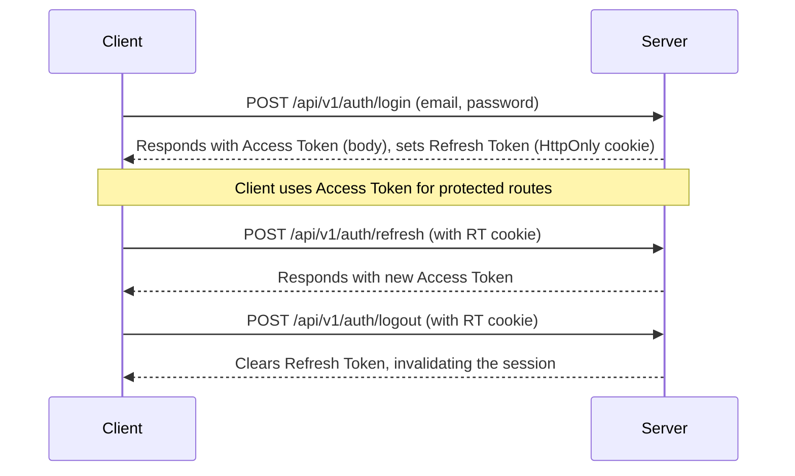

<p align="center">
  <a href="http://nestjs.com/" target="blank"></a>
</p>

# Thai Official Prep API

This is the backend API for the One-Stop Service for Government Exams preparation platform, built with NestJS, Prisma, and PostgreSQL.

## Quickstart

Follow these steps to get the development environment up and running.

### 1. Prerequisites

- [Node.js](https://nodejs.org/) (v18 or later)
- [Docker](https://www.docker.com/) and Docker Compose

### 2. Configure Environment

Create a `.env` file from the example. This file contains all the necessary environment variables.

```bash
cp .env.example .env
```

This project uses the variables defined in `.env.example` by default, which match the `docker-compose.postgres.yml` setup. No changes are needed to get started.

### 3. Start the Database

Run the PostgreSQL database using the provided Docker Compose file.

```bash
docker compose -f docker-compose.postgres.yml up -d
```

### 4. Check & Migrate the Database

Verify the application can connect to the database, then apply the latest schema.

```bash
# Check connection (should return 'SELECT 1')
npm run db:check

# Apply database migrations
npx prisma migrate dev
```

### 5. Run the Application

Start the NestJS application in watch mode.

```bash
npm run start:dev
```

The API will be available at `http://localhost:3000` and the OpenAPI (Swagger) documentation at `http://localhost:3000/api-docs`.

---

## Troubleshooting

- **Prisma Error `P1000` (Authentication Failed):** This means the application cannot connect to the database.
  - **Check `DATABASE_URL`:** Ensure the credentials in your `.env` file are correct.
  - **Check Docker:** Make sure the Postgres container is running (`docker ps`).
  - **Special Characters:** If your password contains special characters (e.g., `@`, `:`, `/`, `#`), they must be **URL-encoded**.

- **JWT Secret Errors on Startup:** The application will fail to start if JWT secrets are missing.
  - **Check `.env`:** Ensure `JWT_ACCESS_SECRET` and `JWT_REFRESH_SECRET` are set in your `.env` file.
  - **Run Check:** Use `npm run env:check` to validate all required variables.

---

## Available Scripts

| Script | Description |
| :--- | :--- |
| `npm run start:dev` | Starts the application in watch mode. |
| `npm run build` | Compiles the TypeScript source code. |
| `npm run test` | Runs unit tests. |
| `npm run test:cov` | Runs unit tests and generates a coverage report. |
| `npm run lint` | Lints the codebase. |
| `npm run env:check` | Validates that all required environment variables are set. |
| `npm run db:check` | Checks the connection to the database. |
| `npm run audit:project` | Generates a project status and coverage report. |
| `npm run api:mock` | Starts the Prism mock server at http://localhost:4010 using `openapi/openapi-v1.yaml`. |
| `npm run openapi:lint` | Lints the OpenAPI spec with Spectral using `.spectral.yaml`. |
| `npm run openapi:export` | Exports `openapi/openapi-v1.yaml` to `openapi/openapi-v1.json`. |

---

## UI Handoff & Key Endpoints

This section provides key information for the UI/frontend team.

### Authentication Flow

The API uses a JWT-based authentication system with an Access Token (AT) and a Refresh Token (RT).



### Endpoints Ready for UI Integration

All endpoints are prefixed with `/api/v1`.

- **Authentication**
  - `POST /auth/login`
  - `POST /auth/refresh`
  - `POST /auth/logout`
- **Users**
  - `GET /users/me` (Requires Bearer Token)
- **Announcements**
  - `GET /announcements` (Public)
- **Subjects**
  - `GET /subjects` (Public)
- **Positions**
  - `GET /positions` (Public)
  - `GET /positions/:id` (Public)
- **Questions**
  - `GET /questions` (Public)
  - `GET /questions/:id` (Public)

### Example cURL Request

```bash
# Get a list of all subjects
curl http://localhost:3000/api/v1/subjects

# Get the current user's profile (replace <ACCESS_TOKEN>)
curl -H "Authorization: Bearer <ACCESS_TOKEN>" http://localhost:3000/api/v1/users/me
```

---

## Mock Server Quickstart

This project includes a Prism-based mock server for UI development based on `openapi/openapi-v1.yaml`.

1) Lint the spec (optional):

```bash
npm run openapi:lint
```

2) Start mock server on port 4010:

```bash
npm run api:mock
```

3) Try sample requests:

```bash
# Announcements (paginated)
curl "http://localhost:4010/api/v1/announcements?page=1&pageSize=10"

# Subjects
curl "http://localhost:4010/api/v1/subjects"

# Questions by subject
curl "http://localhost:4010/api/v1/questions?subjectId=cksubj123"
```

See `docs/ui-integration.md` for auth flow, headers/cookies, and more examples.
